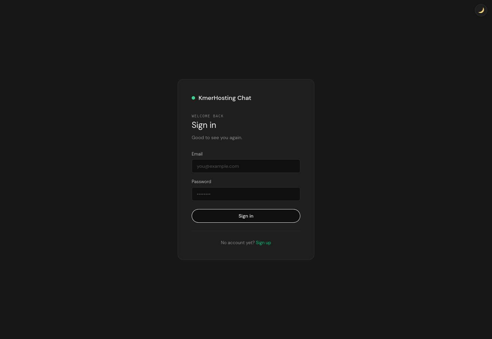
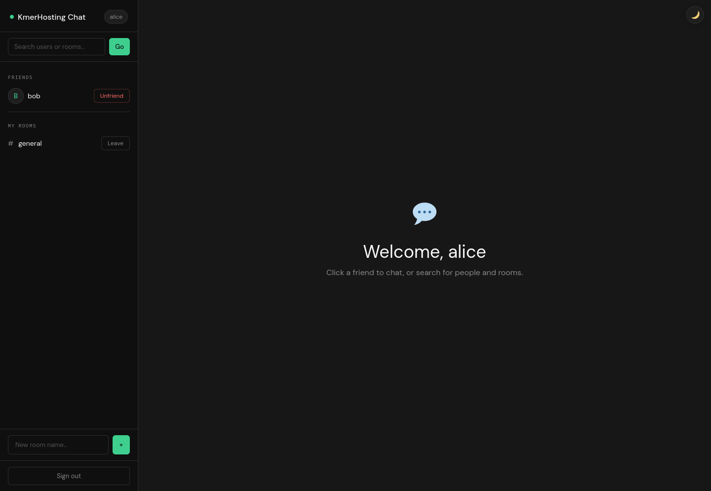
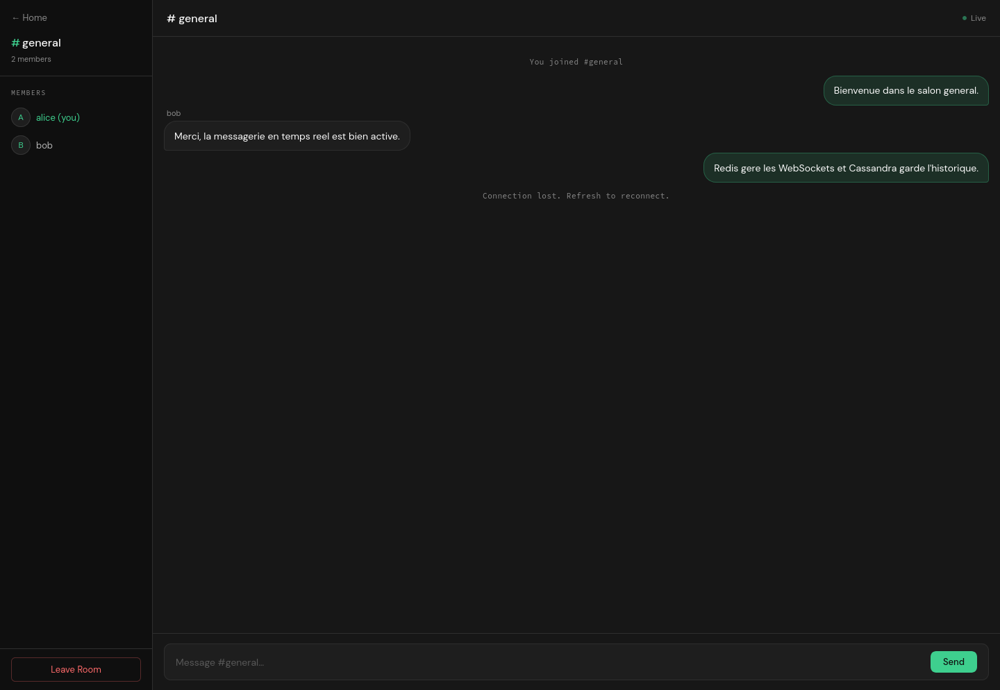
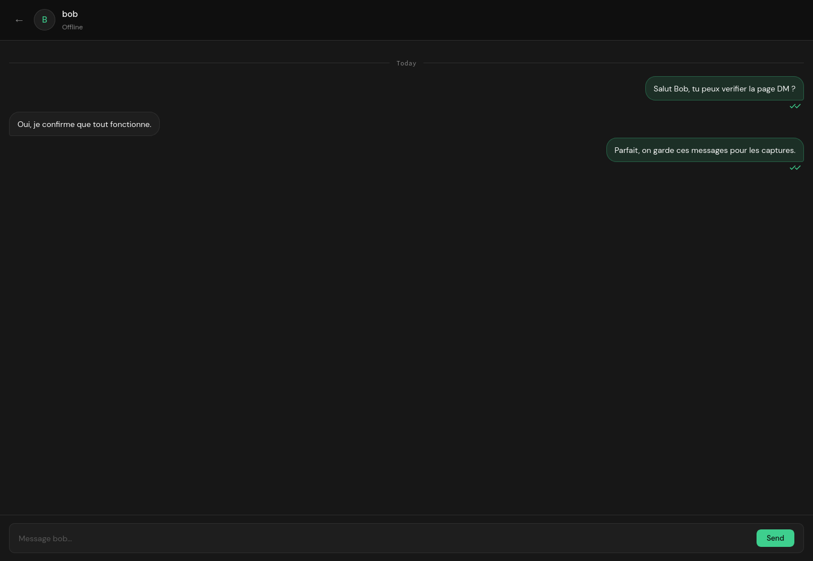

# ChatApp Django

Application de messagerie temps reel construite avec Django, Channels, Redis et Cassandra.

## 1. Presentation

Le projet fournit une petite plateforme de chat avec :

- authentification par email et mot de passe ;
- ajout d'amis et acceptation de demandes ;
- messages prives entre amis ;
- salons de discussion multi-utilisateurs ;
- presence en ligne, notifications et statuts de lecture ;
- persistance de l'historique des messages dans Cassandra.

L'objectif de cette application est de separer les responsabilites :

- Django gere l'interface web, les comptes et les relations sociales ;
- Redis transporte les evenements temps reel via Channels ;
- Cassandra conserve les messages de salon et les messages prives ;
- SQLite garde les donnees relationnelles locales pour le developpement.

## 2. Architecture

### Backend web

- `chatapp/settings.py` centralise la configuration Django, Redis et Cassandra.
- `chat/views.py` gere les pages HTML : inscription, connexion, accueil, salons et DM.
- `chat/models.py` stocke les objets relationnels : `FriendRequest`, `Friendship`, `Room`.

### Temps reel

- `chat/consumers.py` contient trois consumers WebSocket :
  - `NotificationConsumer` pour les demandes d'amis et la presence ;
  - `DMConsumer` pour les messages prives ;
  - `ChatConsumer` pour les salons.
- `chatapp/asgi.py` expose l'application ASGI.
- `chat/routing.py` declare les routes WebSocket.

### Stockage

- SQLite : utilisateurs, salons, demandes et relations d'amitie.
- Cassandra : historique des messages de salon et des messages prives.
- Redis : couche pub/sub et etat de presence.

## 3. Fonctionnalites

### Fonctionnalites utilisateur

- creation de compte ;
- connexion avec email ;
- recherche d'utilisateurs et de salons ;
- envoi et acceptation de demandes d'amis ;
- suppression d'un ami ;
- creation, jointure et sortie d'un salon ;
- discussion privee avec historique ;
- discussion de groupe avec historique ;
- mode clair / sombre ;
- interface responsive mobile.

### Fonctionnalites techniques

- configuration par variables d'environnement ;
- initialisation automatique du keyspace et des tables Cassandra ;
- scripts de demonstration pour peupler des donnees et generer des captures ;
- tests de base pour l'authentification et les salons ;
- support ASGI avec `daphne` pour les WebSockets.

## 4. Prerequis

Vous avez deja les prerequis essentiels :

- Redis sur `127.0.0.1:6379`
- Cassandra sur `127.0.0.1:9042`

Le projet attend le datacenter Cassandra suivant :

- `datacenter1`

## 5. Mise en route

### Environnement virtuel

Le dossier `.venv` a ete cree dans le repertoire du projet.

Activation :

```bash
source .venv/bin/activate
```

### Installation

Si besoin de reinstaller :

```bash
.venv/bin/pip install -r requirements.txt
```

### Variables d'environnement

Copiez `.env.example` vers `.env` si vous voulez personnaliser la configuration :

```bash
cp .env.example .env
```

Variables principales :

- `REDIS_HOST`
- `REDIS_PORT`
- `CASSANDRA_HOSTS`
- `CASSANDRA_PORT`
- `CASSANDRA_KEYSPACE`
- `CASSANDRA_LOCAL_DC`
- `DJANGO_DEBUG`
- `DJANGO_ALLOWED_HOSTS`

### Migrations

```bash
.venv/bin/python manage.py migrate
```

### Lancement

Mode developpement simple :

```bash
.venv/bin/python manage.py runserver 127.0.0.1:8000
```

Mode ASGI recommande pour la couche temps reel :

```bash
.venv/bin/daphne -b 127.0.0.1 -p 8000 chatapp.asgi:application
```

## 6. Donnees de demonstration

Pour injecter des utilisateurs, une relation d'amitie, un salon et des messages de demo :

```bash
.venv/bin/python scripts/seed_demo.py
```

Comptes generes :

- `alice@example.com` / `demo-pass-123`
- `bob@example.com` / `demo-pass-123`

## 7. Captures d'ecran

Les captures ont ete generees et stockees dans [docs/screenshots](/media/hello/tmp/chatapp-django/docs/screenshots).

Generation automatique :

```bash
.venv/bin/python scripts/capture_screenshots.py
```

Fichiers disponibles :

- `docs/screenshots/01-signin.png`
- `docs/screenshots/02-home.png`
- `docs/screenshots/03-room-general.png`
- `docs/screenshots/04-direct-message.png`

Apercus :






## 8. Verification effectuee

Commandes validees dans ce projet :

```bash
.venv/bin/python manage.py check
.venv/bin/python manage.py migrate
.venv/bin/python manage.py test
.venv/bin/python scripts/seed_demo.py
.venv/bin/python scripts/capture_screenshots.py
timeout 5 .venv/bin/daphne -b 127.0.0.1 -p 8010 chatapp.asgi:application
```

Resultats constates :

- Django demarre correctement ;
- Redis est joignable ;
- Cassandra est joignable ;
- les tests passent ;
- le serveur ASGI `daphne` demarre correctement ;
- les captures sont bien produites.

## 9. Structure utile

```text
chatapp/                  configuration Django / ASGI
chat/                     logique metier, vues, models, consumers
chat/templates/chat/      templates HTML
scripts/                  scripts utilitaires de demo et captures
docs/screenshots/         captures d'ecran generees
requirements.txt          dependances Python
.env.example              exemple de configuration
```

## 10. Suite possible

Pour aller plus loin, les prochaines ameliorations naturelles seraient :

- remplacer SQLite par PostgreSQL si l'application passe en production ;
- ajouter de vrais tests WebSocket ;
- ajouter Docker Compose pour l'application elle-meme ;
- securiser davantage les actions sensibles en POST uniquement ;
- ajouter pagination et recherche d'historique dans Cassandra.
