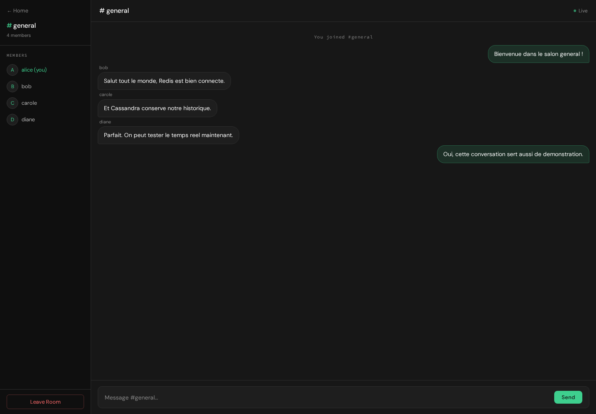
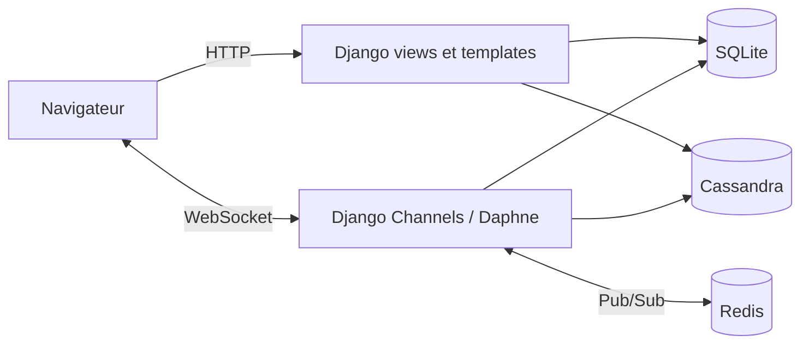
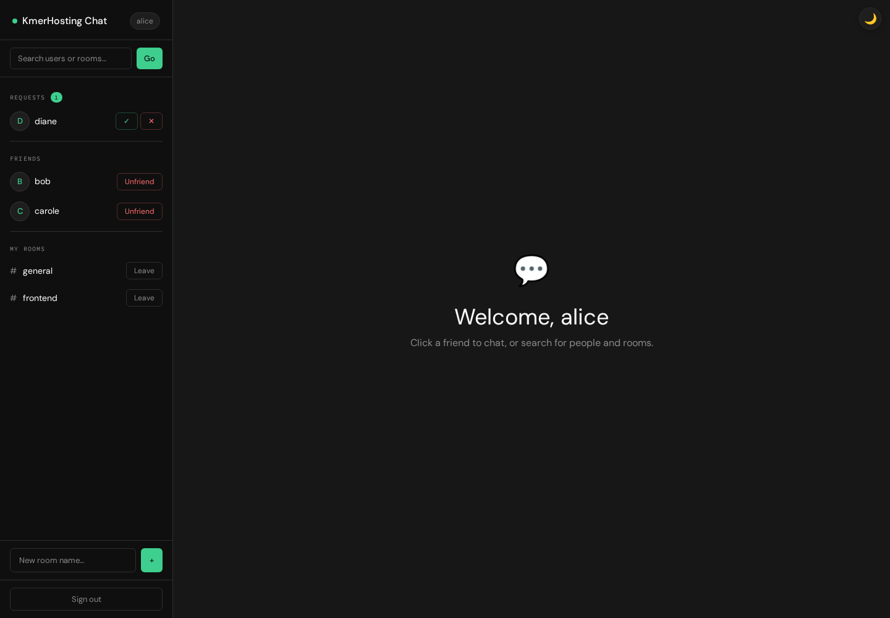
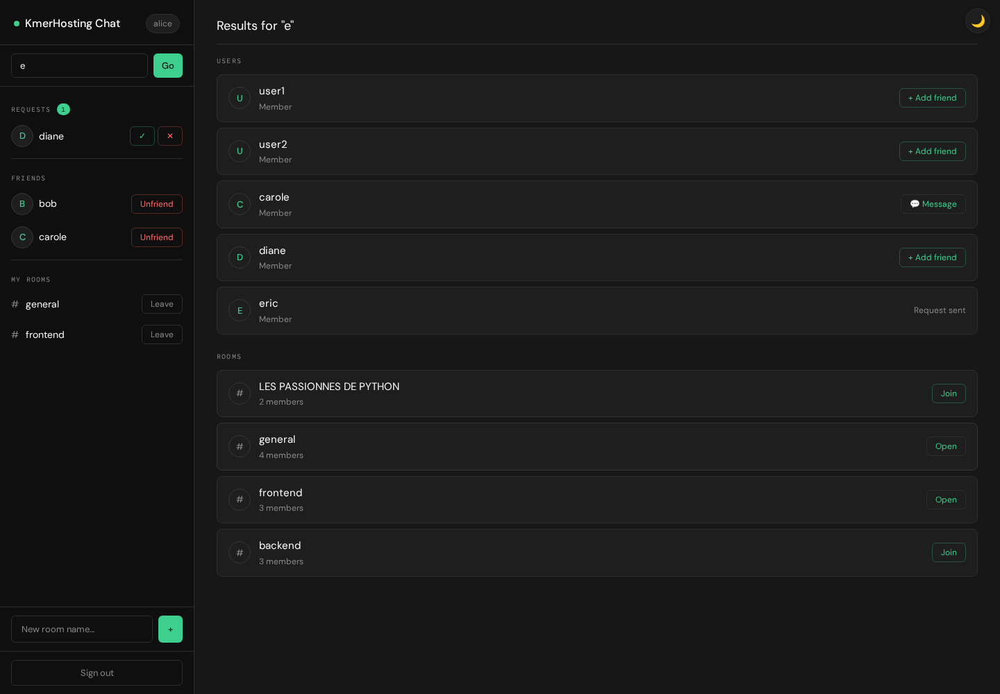
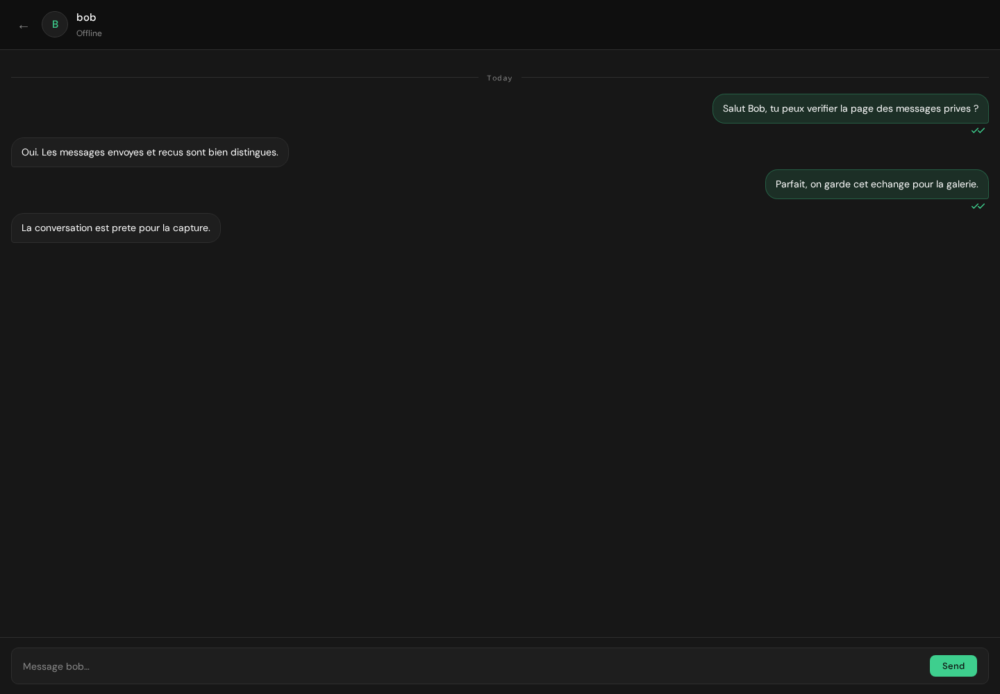
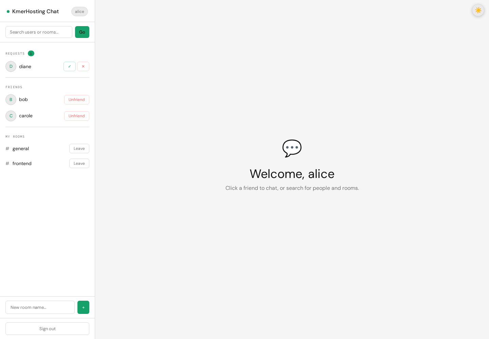
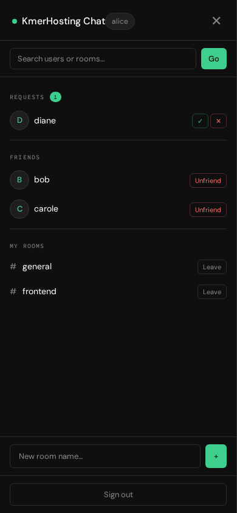
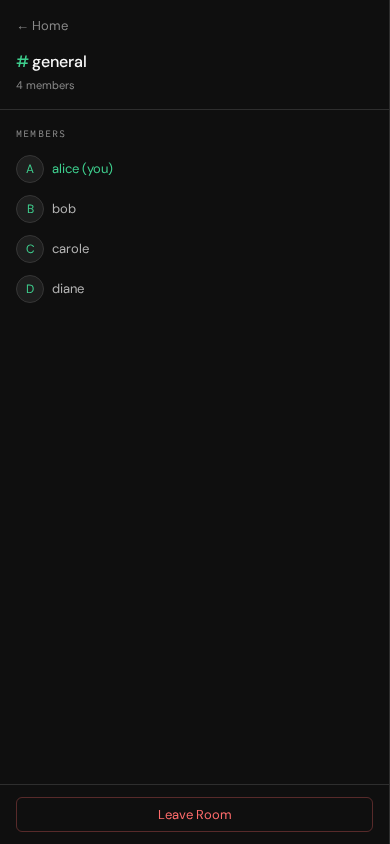

# KmerHosting Chat

Messagerie temps reel open source construite avec **Django**, **Channels**, **Redis** et **Cassandra**. L'application propose des conversations privees, des salons de groupe, un systeme d'amis, la presence en ligne et une interface responsive avec themes clair et sombre.




## Fonctionnalites

- inscription et connexion par email ;
- recherche d'utilisateurs et de salons ;
- demandes d'amis avec acceptation et refus ;
- conversations privees reservees aux amis ;
- salons multi-utilisateurs avec creation, adhesion et sortie ;
- messages, presence et notifications en temps reel par WebSocket ;
- historique persistant dans Cassandra ;
- etats de message `sent`, `delivered` et `seen` ;
- hibernation de la connexion apres inactivite ;
- themes clair et sombre, interface desktop et mobile.

## Architecture



| Couche | Responsabilite |
|---|---|
| Django | authentification, pages HTML, recherche et logique sociale |
| Channels + Daphne | connexions ASGI et consumers WebSocket |
| Redis | channel layer, presence et sessions de lecture actives |
| Cassandra | historique des salons et messages prives |
| SQLite | utilisateurs, amities, demandes et membres des salons |

Le projet utilise trois consumers dans `chat/consumers.py` : `NotificationConsumer` pour la presence et les alertes, `DMConsumer` pour les messages prives et `ChatConsumer` pour les salons. Les tables Cassandra sont creees automatiquement au premier acces par `chat/cassandra_client.py`.

## Galerie des etats

| Accueil et relations sociales | Recherche utilisateurs et salons |
|---|---|
|  |  |
| Message prive | Theme clair |
|  |  |
| Navigation mobile | Membres d'un salon sur mobile |
|  |  |

<details>
<summary>Voir les 16 captures disponibles</summary>

1. [Connexion](docs/screenshots/01-signin.png)
2. [Erreur de connexion](docs/screenshots/02-signin-error.png)
3. [Creation de compte](docs/screenshots/03-signup.png)
4. [Accueil et etats sociaux](docs/screenshots/04-home-social-states.png)
5. [Recherche d'utilisateurs et de salons](docs/screenshots/05-search-users-rooms.png)
6. [Recherche sans resultat](docs/screenshots/06-search-empty.png)
7. [Salon general](docs/screenshots/07-room-general.png)
8. [Salon frontend](docs/screenshots/08-room-frontend.png)
9. [Conversation avec Bob](docs/screenshots/09-direct-message-bob.png)
10. [Conversation avec Carole](docs/screenshots/10-direct-message-carole.png)
11. [Accueil en theme clair](docs/screenshots/11-home-light-theme.png)
12. [Accueil mobile](docs/screenshots/12-mobile-home.png)
13. [Navigation mobile ouverte](docs/screenshots/13-mobile-navigation.png)
14. [Salon sur mobile](docs/screenshots/14-mobile-room.png)
15. [Liste des membres sur mobile](docs/screenshots/15-mobile-room-members.png)
16. [Message prive sur mobile](docs/screenshots/16-mobile-direct-message.png)

</details>

## Installation locale

### Prerequis

- Python 3.10 ou superieur ;
- Redis accessible sur `127.0.0.1:6379` ;
- Cassandra accessible sur `127.0.0.1:9042` avec le datacenter `datacenter1`.

Le projet est deja configure pour les conteneurs Redis et Cassandra presentes dans la description du projet.

### Environnement Python

```bash
python3 -m venv .venv
source .venv/bin/activate
pip install -r requirements.txt
python manage.py migrate
```

Si `python3 -m venv` n'est pas disponible, installez le paquet `python3-venv` de votre distribution.

### Configuration

Les valeurs par defaut fonctionnent avec l'infrastructure locale. Pour les personnaliser :

```bash
cp .env.example .env
```

Les variables disponibles couvrent la cle Django, les hotes autorises, Redis, Cassandra, le keyspace et le datacenter. Django ne charge pas automatiquement `.env` : exportez ces variables dans votre shell ou votre outil de deploiement.

### Demarrage

```bash
.venv/bin/daphne -b 127.0.0.1 -p 8000 chatapp.asgi:application
```

Ouvrez ensuite `http://127.0.0.1:8000`. Daphne est recommande ici car il sert a la fois HTTP et WebSocket.

## Demonstration reproductible

Le seed cree six comptes et remet leurs relations de demonstration dans un etat connu. Il conserve les comptes non lies a la demo.

```bash
.venv/bin/python scripts/seed_demo.py
```

Tous les comptes utilisent le mot de passe `demo-pass-123`.

| Compte | Email | Etat vu par Alice |
|---|---|---|
| Alice | `alice@example.com` | compte principal de la demo |
| Bob | `bob@example.com` | ami, conversation privee peuplee |
| Carole | `carole@example.com` | amie, conversation privee peuplee |
| Diane | `diane@example.com` | demande d'ami recue |
| Eric | `eric@example.com` | demande d'ami envoyee |
| Farah | `farah@example.com` | aucun lien social |

| Salon | Membres de demo | Etat pour Alice |
|---|---|---|
| `general` | Alice, Bob, Carole, Diane | rejoint |
| `frontend` | Alice, Carole, Farah | rejoint |
| `backend` | Bob, Diane, Eric | a rejoindre |
| `random` | Bob, Carole, Farah | a rejoindre |

## Generation des captures

Le script lance automatiquement Daphne si le port cible est libre, se connecte avec Alice, parcourt les etats et remplace la galerie existante.

```bash
PLAYWRIGHT_BROWSERS_PATH=.venv/playwright-browsers \
  .venv/bin/playwright install chromium-headless-shell
.venv/bin/python scripts/capture_screenshots.py
```

Pour capturer une instance deja lancee ailleurs, utilisez `CHATAPP_BASE_URL`, par exemple `CHATAPP_BASE_URL=http://127.0.0.1:9000`.

## Tests et verification

```bash
.venv/bin/python manage.py check
.venv/bin/python manage.py test
.venv/bin/python scripts/seed_demo.py
.venv/bin/python scripts/capture_screenshots.py
```

Les tests couvrent l'inscription, la connexion par email et le controle d'acces aux salons. Les captures automatisent en complement un parcours fonctionnel complet de l'interface.

## Structure du projet

```text
chatapp/                  configuration Django, ASGI et WSGI
chat/                     models, vues, consumers et routes WebSocket
chat/templates/chat/      interface HTML/CSS/JavaScript
scripts/seed_demo.py      donnees de demonstration reproductibles
scripts/capture_screenshots.py
docs/screenshots/         galerie generee
requirements.txt          dependances Python
```

## Avant une mise en production

Cette application est un socle de demonstration. Pour un deploiement public, remplacez SQLite par PostgreSQL, servez les fichiers statiques via un proxy, imposez HTTPS, desactivez `DJANGO_DEBUG`, configurez une cle secrete forte et limitez `DJANGO_ALLOWED_HOSTS`. Les actions de modification devraient aussi passer exclusivement en `POST`, et les consumers WebSocket devraient verifier explicitement l'amitie ou l'appartenance au salon.

## Contribution et licence

Les issues et pull requests sont bienvenues. Le projet est distribue sous [licence MIT](LICENSE).
